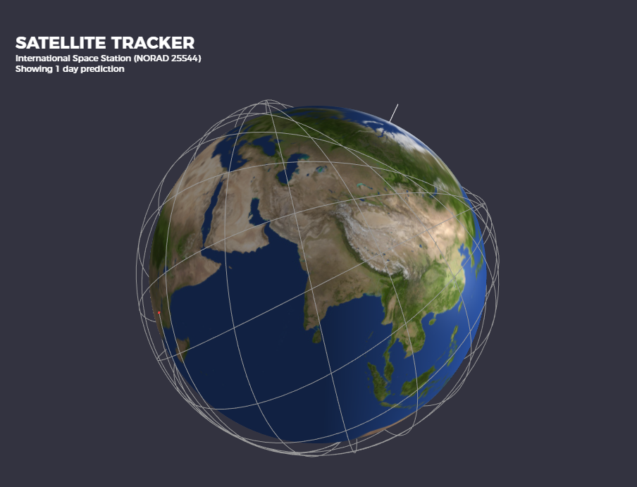
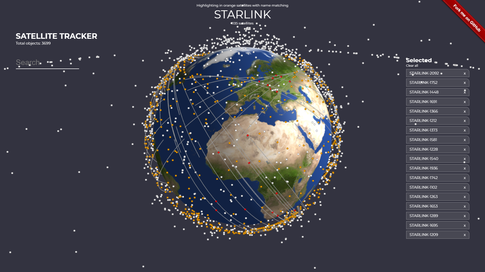
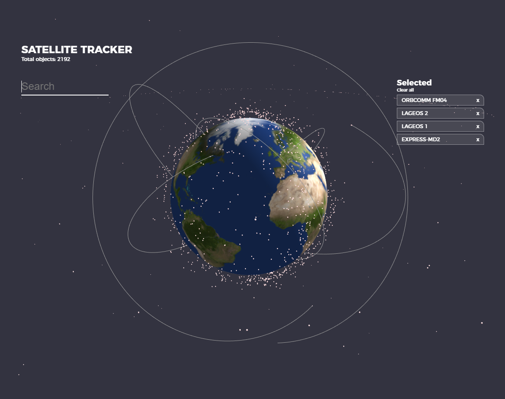
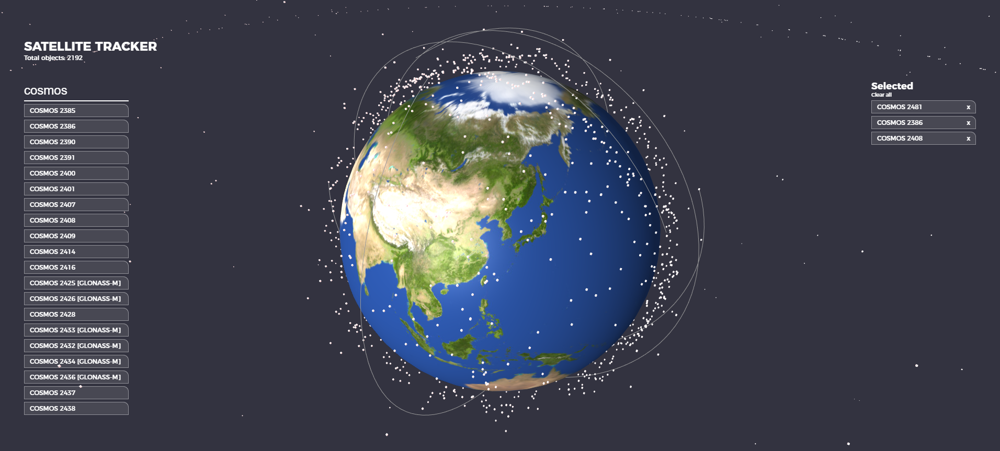
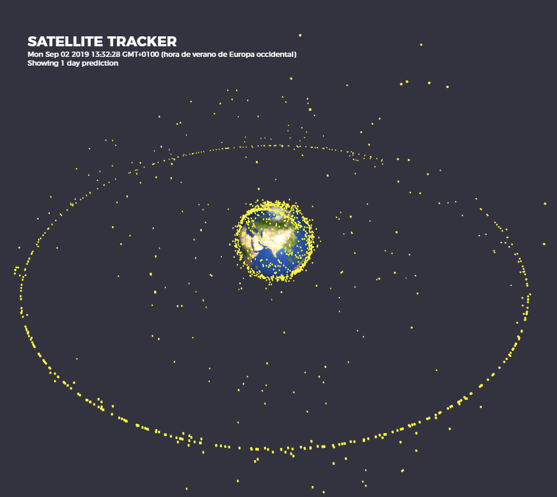
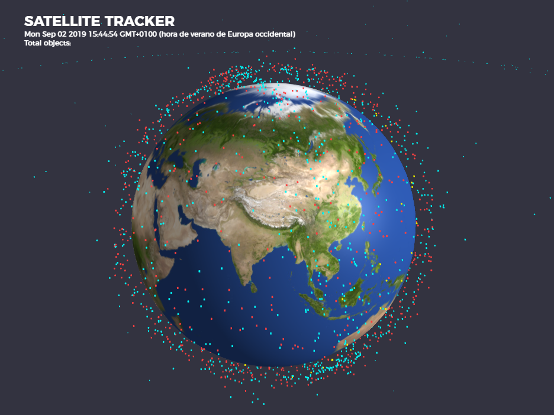

Satellite tracker
=================

Javascript 3D satellite tracker with up-to-date data from CELESTRAK. Uses [Three.js](https://threejs.org/), [React](https://reactjs.org/) and [satellite.js](https://github.com/shashwatak/satellite-js) for orbit prediction. 

It is meant as a simple 3D engine that can be used to draw your own satellite orbits. Out of the box it can filter and highlight satellites by name or clicking directly on them, but you can extend / reuse it by looking at the App.js file and loading the satellite set you prefer or changing how orbits are displayed.  

[Live DEMO displaying IIS orbit](https://dsuarezv.github.io/satellite-tracker?ss=25544)

[Live DEMO highlighting SpaceX's StarLink constellation](https://dsuarezv.github.io/satellite-tracker?highlight=starlink)

Here is a nice screenshot showing the predicted International Space Station orbit through a day. (Side note, [Why doesn't ISS pass over the polar regions?](https://space.stackexchange.com/questions/5297/why-doesnt-iss-pass-over-the-polar-regions)). The orbits are displayed in the ECEF (Earth Centered Earth Fixed) reference frame. 

StarLink satellites highlighted in orange, some of them displaying orbits:

Some random satellites selected: 

Some COSMOS satellites with orbits. Search and select interface:

Beidou satellites orbits in ECI reference frame. ECI mode can be enabled by setting UseDateSlider = true in App.js. Please note that this mode needs further testing and is not complete yet. 

Active objects from CELESTRAK (http://www.celestrak.com/NORAD/elements/active.txt)

Here debris from cosmos-2251 in red, active sats in blue, stations in yellow: 

Installation
============

    $ git clone https://github.com/dsuarezv/satellite-tracker
    $ cd satellite-tracker
    $ npm install
    $ npm start

That should start a [parcel](https://parceljs.org/) dev server. Browse to http://localhost:1234 to see it in action. In case parcel is not installed, follow instructions on their site. You should be able to run it with this command: 

    $ parcel index.html
